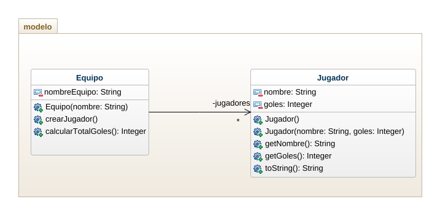

# CasoEquipoFutbol

## Enunciado

## Diagrama de clases

### Actividades

1. Plantee un enunciado corto para el problema que se pretende resolver.
2. Cree una clase ejecutable para crear instancias de la clase Equipo y jugadores.
3. Agrege un método que permita hallar el jugador con mas goles.
4. Modifique el programa para manejar la edad del jugador y que calcule el promedio de edades de los jugadores.
5. Modifique el programa para menejar el código del judagor y resuelva que dado el código, incremente los goles en 5.
6. Cree un programa, usando el patrón MVC, que permita manejar y gestionar la información del equipo de futbol y los jugadores, teniendo en cuenta las funcionalidades descritas en los puntos anteriores. 
